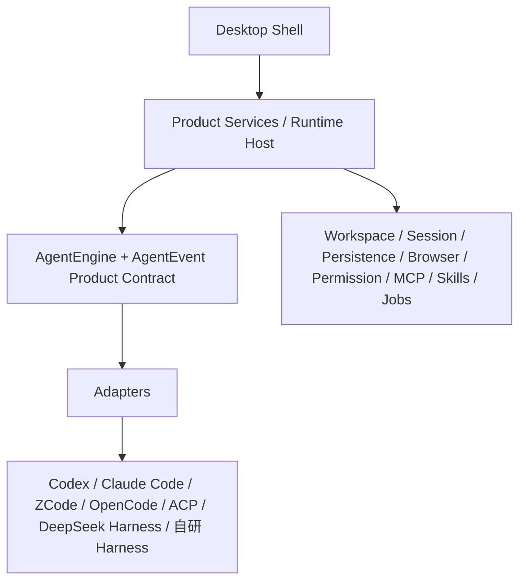

# AnyAgent Vision

## 文档状态

本文描述 AnyAgent 的目标设计，不是当前实现或排期；本次范围是定位与愿景文档，Deferred、Non-goals 与建议切片见下文。项目概览见 [README](README.md)。

## 核心主张

> Your workspace, any agent.

工作环境属于用户，Agent 可以换。AnyAgent 的重点是工作资产的连续性：项目、任务、历史、浏览器状态、权限、工具和上下文不应因为底层引擎变化而被迫搬家。

AnyAgent 保持独立开源、本地优先、Harness 中立、模型中立和工作区中立：产品不把某个 Harness 当作唯一控制中心；Model 与 Engine 分开，后者还拥有 loop、context、tools 等运行语义；Workspace 承载环境，Engine 承载 Agent 运行，两者按能力组合而不是隐式绑定。本地优先不等于模型或所有引擎都离线。

价值由用户是否能稳定保留并继续使用自己的工作资产衡量，不由接入数量衡量。

## 双层长期定位

### Universal Agent Desktop

这是完整可用的桌面参考产品。它提供统一的项目、任务、历史、浏览器、终端、权限、工具和版本控制体验，并将不同引擎的差异表达为能力，而不是要求 UI 绑定某个供应商。

### Desktop Agent App Starter Kit

这是面向开发者的长期目标：帮助已有 Agent 获得桌面产品形态。Starter Kit 应来自参考产品中已经验证的边界和实现，不预设未经验证的目录、Provider 层或通用脚手架。

### Core + Reference App

长期形态由可复用 Core 与参考产品组成。开发者可以复用参考产品提供的桌面能力，通过 Adapter 把已有 Agent 接入 Chat、Task、Browser、Terminal、Diff、Git、Permissions、Workspace、本地运行、远程工作区与发行能力。

这些是目标能力集合，不表示当前已经提供或每个引擎都支持。

Starter Kit 的价值是减少开发者重写 Shell 与共享服务的工作；具体边界应由参考产品先行验证。

### 产品独立性原则

参考产品应能剥离对品牌、账户、计费、更新、遥测和分享服务的绑定。默认采用本地能力，云端或外部服务按需启用并可替换；不先为每项能力发明 Provider，只在实际边界要求时抽象。

## 使用者

AnyAgent 面向三类使用者：直接在同一工作环境中选择和恢复 Agent 的人；把自研 Agent 接入产品契约的 Adapter 开发者；以及在 Core 和参考实现之上定制交互、发行和 Agent 组合的团队。

## 长期架构

Desktop Shell 负责桌面窗口、导航、任务与产品级交互，消费产品契约和能力声明，不直接依赖某个第三方引擎的内部类型。

### 产品服务与 Runtime Host

Runtime Host 负责产品需要共享的运行时语义，包括：

- Workspace：工作区与执行环境的连接。
- Session：会话创建、恢复、历史和生命周期。
- Persistence：本地数据与产品历史的保存。
- Browser：浏览器标签、登录状态和用户可见操作。
- Permission：统一的授权交互与实际权限映射。
- MCP、Skills、plugins、Tools、Hooks 与 UI 扩展的产品级管理。
- Jobs：任务自动化及其生命周期。

产品层不把这些共享能力等同于任何单一引擎的私有状态。供应商认证可以按原支持边界复用；云同步、团队能力和 relay 是可选层，不是核心依赖。

### AgentEngine 与产品契约

AgentEngine 描述一个引擎可被产品使用的会话语义：创建或恢复会话、发送消息、steer、interrupt、订阅事件，以及 approval、answerUserInput、dispose 等生命周期操作。

产品契约表达共同语义，Adapter 负责映射到各引擎实际支持的接口。AgentEvent 至少需要容纳文本输出和可用的 reasoning、Tool 调用和结果、Shell、文件变化与 Diff、Approval 与用户输入、Plan 与 Subagent，以及 Usage、生命周期和错误。

Common Core 提供共同语义，显式 capability 与 extension 保留引擎差异。UI 根据声明展示操作，既不假设引擎支持一致，也不为了统一丢掉高级能力。

TanStack AI、AG-UI 是可替换的桥接或 Adapter Pack 候选，具体 API 与适配边界仍需核实。即使采用，UI 也应依赖产品契约，避免直接绑定第三方类型。

DeepSeek Harness 可以作为与其他 Harness 同级的可选引擎接入，不需要成为统领所有引擎的主 Agent。

## 产品级共享能力

### Browser

Browser 是产品级共享层，目标包括标签、登录状态和用户可见的浏览器操作。经用户授权的 Tool 或 MCP 可以把浏览器能力交给引擎使用。

共享 Browser 不等于所有引擎都自动获得相同能力；授权、宿主限制和实际执行边界仍需由 Adapter 与运行环境映射。

### Workspace

Workspace 与 Engine 分离。Workspace 可能位于 Local、SSH、WSL 或 Docker，Engine 也有自己的运行要求；两条轴线的组合是否可用，需要实际验证，不承诺任意组合都能自动工作。

### Permissions

产品提供统一的权限交互与状态表达，但统一 UI 不能绕过引擎或 host 的真实限制。授权是共享能力的一部分，却不是无限授权；执行前仍需遵守对应环境和引擎的权限边界。

### MCP、Skills、Tools、Hooks 与 UI 扩展

这些能力由产品层管理，并通过适配层接入具体引擎。产品级可见不代表不同引擎之间自动兼容，也不意味着一个引擎的内部扩展状态可以直接迁移给另一个引擎。

### Computer Use

Computer Use 与 Browser 分开建模，目标是覆盖截图、无障碍信息、鼠标和键盘等电脑操作能力。它需要独立评估和建设，不能因为复用某个 Shell 就视为已经获得。

### Repo Wiki

Repo Wiki 的长期目标是提供源码引用、本地持久化、刷新和 Engine-neutral 的仓库知识层。它同样需要独立评估和建设，不因导入参考 Shell 而自动存在。

## Session、历史与 Handoff

Session 绑定创建它的 Engine。恢复 Session 时应恢复原 Engine，并把产品历史与引擎内部状态清楚分开。

跨引擎切换采用显式 Handoff，创建新会话并传递适合目标引擎的材料，例如目标、摘要、差异、文件、TODO 和必要上下文。

Handoff 不承诺无损热切换，也不隐式搬运原引擎的上下文压缩、Tool 状态或私有运行状态。共享历史应服务于可追踪和可恢复，不能掩盖引擎之间真实的语义差异。

## 参考来源与项目边界

AnyAgent 是独立项目，有自己的身份和版本。计划参考 [ZCode](https://github.com/zai-org/ZCode) 的 Shell 方向，可能借鉴 Electron、React、UI、workspace、browser 和 remote 相关部分；该链接仅标记参考来源，不代表官方关联或能力背书。

当前 AnyAgent 尚未导入 ZCode；复用方式、具体基线、Protocol v4 是否作为过渡，以及许可和 NOTICE 的处理，都需要在实际切片中确认。项目许可见 [LICENSE](LICENSE)。

## 建议的验证切片

以下是按结果和验收标准组织的建议顺序，不是已经启动的排期：

1. 引入 Shell 后，先确认可以构建和运行，再用原 ZCode 与一个待选择的异构引擎在同一工作区验证新建会话、发送、stream、tool、shell、file、diff、approval、stop 和 resume；主要验收审批拒绝、停止、恢复是否正确，且不影响其他会话。
2. 尽早验证共享 Browser，包括标签、登录状态、用户可见操作、授权路径和引擎边界；可安排在基础会话切片之后的共享层阶段。
3. 根据验证结果扩展其他 Engine 与远程 Workspace，补齐能力声明、权限映射和历史恢复边界。
4. 在参考产品已有证据后，再建设 Repo Wiki、Computer Use、Automation/Jobs、Handoff、多引擎协作、workflow、shared memory/context 与 Starter Kit。

第一片验证的是基础契约，不等于完整产品目标。每个阶段以行为结果和验收为准，而不是以日期或接入列表为准。

## 本次范围

本次只交付项目定位与愿景文档，记录 AnyAgent 的身份、价值、目标架构、共享能力边界、建议验证切片、待验证决策和成功标准；当前没有代码、构建、安装或运行入口。

## Deferred

以下能力留待基础参考产品验证后推进，前文相应章节描述了目标边界：

- 共享远程工作区。
- Repo Wiki 与 Computer Use（CUA）。
- Jobs/Automation。
- 跨引擎 Handoff、多引擎 workflow 与协作编排。
- shared memory/context。
- Desktop Agent App Starter Kit、通用脚手架与 Provider 抽取。
- 非 Coding 场景探索。

## Non-goals

首版不以以下事项为目标：

- 重写 Harness，或同时接入全部 Engine。
- 承诺无损热切换私有上下文、压缩状态、Tool 状态和运行状态。
- 强制某个 Engine 统领全部引擎。
- 复制商业 SaaS，或把核心绑定到项目级云服务。

## 待验证决策

后续实现需要用真实切片回答以下问题：

- AgentEngine 产品契约怎样覆盖共同语义，同时保留各引擎的能力差异？
- Protocol v4 是否适合作为过渡，以及 Adapter 的边界放在哪里？
- Workspace、Engine、Host 和 Permission 的能力矩阵如何表达，才能让 UI 不误导用户？
- Browser 的登录状态、用户可见操作和授权路径如何在不同宿主中保持可追踪？
- 产品历史、事件持久化与引擎内部状态如何分层，才能支持恢复和 Handoff？
- 哪些桥接或 Adapter Pack 值得采用，且不会让 UI 绑定未经核实的第三方 API？

## 目标成功标准

AnyAgent 达到长期目标时，应能用可复现的行为证明：

- 用户可以在同一工作环境中创建、恢复和追踪任务，且任务历史不依赖某个引擎的私有 UI。
- 同一 Workspace 可以在明确的能力边界内连接多个 Engine；UI 会按声明展示可用操作。
- 基础消息、stream、tool、shell、file、diff、approval、stop 和 resume 语义可以被不同 Adapter 验证。
- Browser、Permission、Workspace 与 Session 等共享资产有清楚的归属、授权和恢复边界。
- 跨引擎 Handoff 可把目标、摘要、差异、文件、TODO 和必要上下文交给新会话，同时明确不可无损迁移的状态。
- 开发者接入自研 Harness 时，可以复用 Shell 与共享服务，主要实现 Adapter，不需要重写整套产品。
- 参考产品的实际边界足够稳定，才能抽取可维护的 Core 与 Desktop Agent App Starter Kit。

## 出处

本文基于 2026-09-21 至 2026-09-22 的相关讨论整理：[ChatGPT 对话](https://chatgpt.com/g/g-p-6aa77034ee0081918bd6fd28f529bb59/c/6ab0ee98-a71c-83e8-bb4b-e163a33c316b)。
