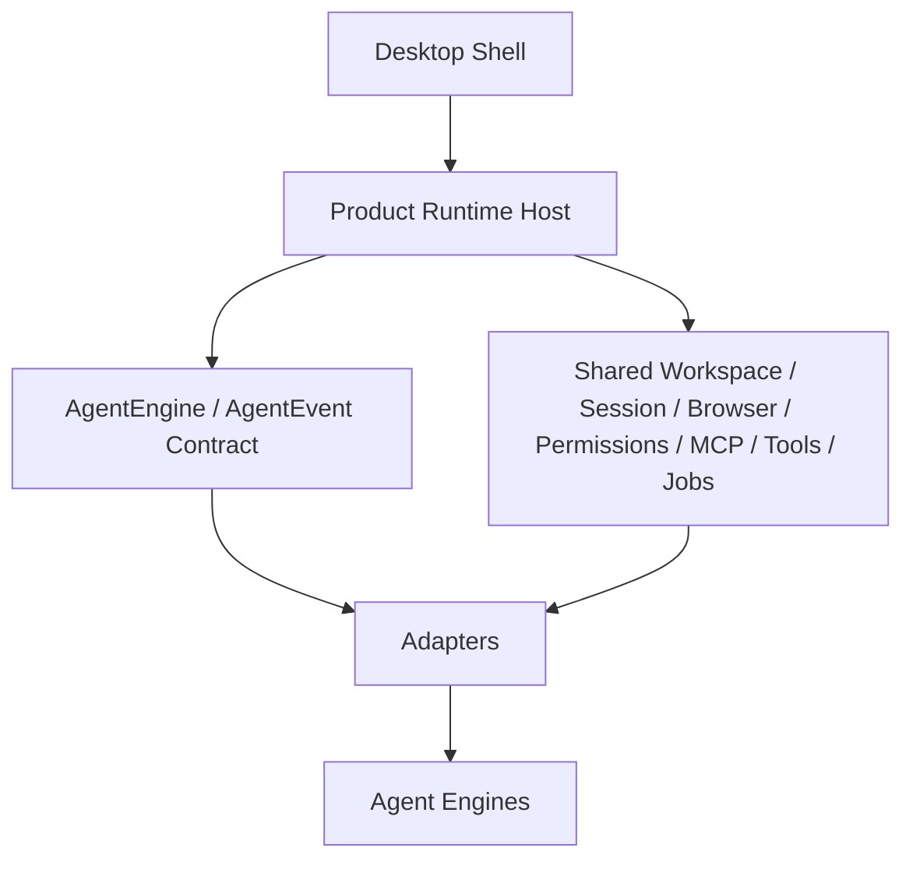

# AnyAgent Vision

> Your workspace, any agent.

我们希望 AnyAgent 最终成为一个让工作环境真正属于用户的桌面 Agent 工作台：项目、任务、历史、浏览器状态、权限、工具和上下文可以持续留在同一工作台里，底层 Engine 可以更换。项目概览见 [README](README.md)。

Coding Agent 是核心场景，覆盖代码工作中的会话、工作区、终端、文件、差异、Git、浏览器和审批体验，同时为其他需要 Agent 与工作资产协作的场景保留空间。

## 产品定位

AnyAgent 有两层长期定位：

- **Universal Agent Desktop**：完整可用的桌面参考产品，让用户在同一环境中选择、恢复和使用不同 Agent。
- **Desktop Agent App Starter Kit**：让开发者基于已有 Agent 构建桌面产品，复用桌面界面、共享服务和发行能力。

长期形态是 **Core + Reference App**。Core 承载稳定的产品能力与共同契约，Reference App 提供完整的交互、运行和发行体验；开发者通过 Adapter 接入自己的 Agent，而不是为每个 Agent 重写整套产品。

AnyAgent 保持独立的项目身份、版本和产品边界。它是 Harness 中立、模型中立、工作区中立的桌面产品，价值在于工作资产可以随用户持续使用，而不是接入数量本身。

## 使用者

- **直接使用桌面的人**：在同一工作环境中选择适合任务的 Agent，保留任务历史与工作资产。
- **Adapter 作者**：把自研 Harness 的会话和事件接入产品契约，复用现成的桌面与共享能力。
- **定制产品的团队**：在 Core 和 Reference App 之上定制交互、Agent 组合、品牌与发行方式。

## 产品原则

### Engine 与 Model 分开

Model 是 Engine 使用的模型；Engine 还拥有自身的推理循环、上下文、原生工具和私有运行状态。产品围绕 Engine 提供共同契约，同时保留每个 Engine 的能力差异与高级扩展。

Codex、Claude Code、ZCode、OpenCode、支持 ACP 的 Agent、DeepSeek Harness 和自研 Harness 都可以作为同级 Engine 接入。任何一个 Harness 都不需要统领其他引擎，UI 也不把某个引擎的能力假定为所有引擎都支持。

### 本地优先与产品独立

核心能力可以本地存储和运行，不依赖项目级 SaaS；本地优先不等于所有模型或 Engine 都离线。供应商认证沿用各 Engine 的支持边界，云同步、团队能力、relay 和其他云服务可以按需启用或替换。

Reference App 的品牌、账户、计费、更新、遥测和分享服务可以独立定制，基础使用不依赖特定厂商的服务。

### 工作区与权限有真实边界

Workspace 与 Engine 是两条轴线。工作区可以位于 Local、SSH、WSL 或 Docker，Engine 另有自己的运行要求；产品表达可用能力，但不假设任意组合都天然可用。

统一的权限交互让用户知道 Agent 将要做什么、正在做什么以及为什么需要授权。它不能绕过 Engine 或 host 的实际约束；高影响操作应让用户可观察、介入和中止。

## 参考架构

Desktop Shell 负责窗口、导航、任务和产品交互。Runtime Host 负责工作区、会话、历史持久化、浏览器、权限、扩展和自动化等产品级共享能力。AgentEngine 管理自身的推理循环、上下文、原生工具和私有运行状态，并通过产品契约向 UI 表达事件与能力。

Engine 原生工具（Engine-native tools）由各 Engine 管理；产品共享工具（Product-shared tools）及共享 Browser、MCP、Workspace、Permissions 由 AnyAgent 产品层提供，可跨 Engine 复用。Adapter 连接两侧，将共享能力映射到具体 Engine 支持的接口，同时保留各自的归属与权限边界。

共同契约能够表达文本、推理、工具、Shell、文件与 Diff、审批与用户输入、计划、子代理、用量、生命周期和错误等事件。能力声明让 UI 展示真实可用的操作，同时保留不同 Engine 的高级能力，不把差异压缩成最低公分母。

## 共享产品体验

### Workspace、Terminal、File、Diff 与 Git

工作区是项目、文件和执行环境的共同归属。Terminal、File、Diff 和 Git 让用户从同一产品表面观察和管理代码工作；具体执行仍遵循工作区、Engine 与 host 的权限边界。

### Browser

Browser 是共享的产品能力，包含标签、用户可见操作和经授权的登录状态。用户可以观察浏览器行为，并通过 Tool 或 MCP 将明确授权的浏览器能力交给 Engine 使用。

Browser 与 Computer Use 分开建模。Computer Use 面向截图、无障碍信息、鼠标和键盘等电脑操作，让用户在需要时观察、介入或中止操作。

### MCP、Skills 与 Plugins

产品共享的 MCP、Skills、Plugins、Tools、Hooks 和 UI 扩展由产品层管理，再通过 Adapter 映射到具体 Engine。产品提供统一的发现、配置和权限体验，但不同 Engine 的兼容能力仍由各自契约表达，其原生工具与内部扩展仍由自身管理。

### 知识与资料

用户的知识与资料独立于 Engine 保存，并在明确授权下供不同任务和插件复用。产品提供资产访问、持久化、权限与扩展机制；索引、检索、来源引用和变化检测可以作为可复用的知识能力按需提供，不要求全部内置或始终启用。

### 任务、历史与协作

任务历史记录用户做过什么、Agent 产生了什么结果以及哪些决定需要继续。Automation 与 Jobs 让重复工作可被安排和观察；多引擎协作与 workflow 让不同 Engine 在清楚的边界内共同完成任务；共享 context 与 memory 让授权的经验和资料能够跨任务复用。

这些共享资产由用户控制，并受会话、工作区和权限范围约束。产品历史属于产品层，Engine 的私有运行状态仍属于原 Engine。

## 领域工具与插件

领域工具与插件利用共享能力，提供适合具体场景的知识组织和工作方式。用户可以按需选择，也可以在更换 Engine 后继续使用这些工具与资产。

Repo Wiki 是面向代码仓库的领域工具或插件示例：将代码分析结果组织为带源码引用、可刷新、本地保存的知识文档。个人知识库、研究资料库等插件可以服务其他场景，而不要求用户采用仓库 Wiki 的组织方式。

这类扩展可以由官方提供并与桌面深度集成，但不因此成为所有用户必需的系统核心。跨 Engine 复用是一项能力，不决定它属于产品核心还是领域插件。

## Session 与 Handoff

Session 与创建它的 Engine 绑定。恢复 Session 时恢复原 Engine，使历史、上下文和工具状态的归属保持清楚。

当用户需要跨 Engine 继续工作时，Handoff 创建一个新会话，并传递目标、摘要、差异、文件、TODO 和必要上下文。交接清楚标明可复用的材料与无法迁移的私有状态；新 Engine 根据自己的能力重新建立上下文，用户能够追踪工作如何延续。

## 我们希望带来的改变

- 用户可以在同一工作环境中持续管理项目、任务、历史、浏览器和权限，Engine 变化不会迫使工作资产搬家。
- 用户可以根据任务选择不同 Engine，并清楚看到每个 Engine 能做什么、哪些操作需要授权以及如何中止。
- Adapter 作者可以接入自研 Harness，复用 Shell、共享服务、工作区、权限和发行能力，不需要重写整套产品。
- 定制团队可以从独立的 Core 和 Reference App 出发，保留自己的产品身份，同时共享经过验证的桌面 Agent 基础。
- Coding 是深度起点；写作、研究和其他需要长期工作资产的 Agent 场景可以沿用相同原则逐步展开，而不预设一个无边界的通用 Agent OS。

## 参考与出处

AnyAgent 基于 [ZCode](https://github.com/zai-org/ZCode) 二次开发，保持独立的项目身份与版本。项目许可见 [LICENSE](LICENSE)。

本文基于 2026-09-21 至 2026-09-22 的相关讨论整理：[ChatGPT 对话](https://chatgpt.com/g/g-p-6aa77034ee0081918bd6fd28f529bb59/c/6ab0ee98-a71c-83e8-bb4b-e163a33c316b)。
