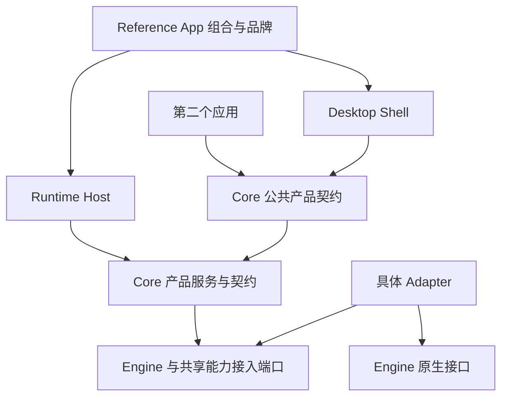
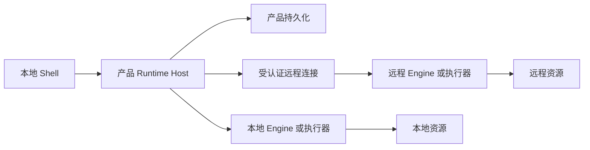

# 系统架构与公共边界

目的与范围：说明 Core + Reference App 的组织、依赖和替换边界；运行与安全细节见[运行与信任边界](runtime-and-trust-boundaries.md)，导入设计见 [ZCode 过渡](zcode-transition.md)。

设计状态：Proposed；遵循已接受的 [ADR 0001](../decisions/0001-domain-tools-are-optional-plugins.md)、[ADR 0002](../decisions/0002-engine-native-and-product-shared-tools-are-distinct.md) 和 [ADR 0003](../decisions/0003-cross-engine-collaboration-is-task-scoped.md)。本文不批准新技术选型。

实现与验证状态：2026-09-22 检查 AnyAgent `intial` 分支、提交 `2b2c3b55ffcea62cd75e4bff9bafe9f55482523f`。跟踪文件为 README、VISION、LICENSE、AGENTS 和决策文档及索引脚本；未发现应用源码、依赖声明、Runtime 或业务测试。当前实际可执行逻辑只有 [ADR 索引生成](../decisions/generate-index.sh)及其[测试脚本](../decisions/test-generate-index.sh)。以下模块和流程均为待实现设计，不能引用为已支持能力。

关联权威：[产品愿景](../../VISION.md)、[领域定义](../domain/README.md)、[状态归属](../domain/lifecycle-and-ownership.md)、[Engine 契约](../specs/engine-adapter.md)、[协作契约](../specs/cross-engine-collaboration.md)、[共享能力契约](../specs/shared-capabilities.md)。

## ARC-01：组织与依赖

首选一个模块化 Runtime Host 承载产品服务。模块边界由责任和公共契约确定，不预先拆成微服务。Desktop Shell 与 Host 在部署上允许分进程；Engine 是否为子进程、嵌入库或远程服务取决于实际接入，不由图示强制规定。

图中箭头表示使用或依赖，Engine 事件经 Adapter 反向返回，不表示 Engine 依赖 Core。Host 作为组合入口装配实现；产品服务依赖端口，由 Adapter 实现端口，避免 Core 导入具体 Harness SDK。

| 边界 | 责任 | 不承担的责任 |
| --- | --- | --- |
| Core | 产品身份、Task/Workflow 协调、授权范围、共享资产、持久化端口及公共行为契约 | Reference App 品牌、账户、计费、强制遥测或项目 SaaS |
| Reference App | 默认交互、产品配置、模块组合、品牌及发行选择 | 将私有 UI 状态变成 Adapter 必需输入 |
| Desktop Shell | 窗口、导航、用户观察和介入、系统集成；消费产品协议 | 在 UI 内作为任务状态唯一持有者或自行批准工具执行 |
| Runtime Host | 装配产品服务、连接执行宿主、进程监督、持久化与恢复入口 | 接管 Engine 的 Agent Loop 或解释其未公开私有状态 |
| 产品服务 | 协调、Session 映射、资产与权限服务；可在同一 Host 内调用 | 每个名词必配一个进程、网络服务或数据库 |
| Adapter | 原生协议与行为映射、能力探测、错误及事件来源标注 | 为缺失能力伪造恢复、取消确认或用量 |
| Engine | 自身 Loop、Model 使用、原生工具、上下文与私有状态 | 自动拥有产品共享资产的全部权限 |

Core 定义共享能力的公共边界；具体 Browser、Computer Use、知识检索、远程连接器、自动化执行器与云服务可以按应用需求选择装配。未装配时按能力契约显示不可用。Repo Wiki 保持可选领域插件，遵循 ADR 0001。Core、Adapter 和公共 UI 组件不得反向导入 Reference App 的品牌、账户或内部状态。

## ARC-02：三层契约

| 契约 | 消费方与生产方 | 稳定内容与变更边界 |
| --- | --- | --- |
| UI 产品协议 | Shell/其他应用 ↔ 产品服务 | 产品身份、命令接纳、投影、能力、审批及事件关联；不暴露 SDK 对象为必需字段 |
| Host 内部契约 | 产品服务 ↔ 持久化、资源执行器、Adapter | 资源授权上下文、产品与原生身份映射、执行确认及诊断；可随实现调整但不能改变对外语义 |
| Engine 原生协议 | Adapter ↔ Engine | 遵从相应版本真实接口；私有上下文、原生工具与状态仍归 Engine |

首版不决定 IPC 编码、数据库表或消息中间件。Host 内部优先直接模块调用；跨进程才引入传输映射。公共协议需要独立版本协商和兼容测试，但不承诺任何已有 ZCode、ACP、MCP 或 JSON-RPC 消息可直接替换它。协议形式相同不代表身份、生命周期、权限和错误语义相同。

接入自研 Engine 的验收以[最小 Adapter 契约](../specs/engine-adapter.md)为准；普通模型 API Adapter 只能承担模型调用。若以模型 API 构建 Engine，还需要明确拥有 Loop、工具执行、Session 和取消行为的 Harness 实现；不得将文本流包装为完整 Harness 后声称能力等价。

## ARC-03：确定性协调与可选智能参与者

Task/Workflow 服务持有依赖、显式消息、授权范围、预算和整合责任；依条件派发、限制重试、记录结果及传播取消属于确定性职责。可以按任务配置一个智能协调参与者，使用普通 Engine/Adapter 契约；其计划建议仍经过产品授权与任务规则校验。产品协调不依赖额外 LLM 主 Agent，也没有固定统领所有 Harness 的 Engine。

领域关系和生命周期只在[领域文档](../domain/README.md#DOM-02)与[状态模型](../domain/lifecycle-and-ownership.md#LIFE-02)定义。产品投影不是 Engine 原生会话库；恢复与 Handoff 的行为分别由规格规定。

## ARC-04：本地与远程部署

首选产品协调和历史权威位于用户控制的 Host；远程执行器只拥有其运行事实和环境内资源，产品保存已确认事实及观测缺口。本地优先允许在线模型和远程 Engine。Workspace 位置、Engine 位置和浏览器位置分别声明；只有路径映射、传输、认证、工具、权限和恢复均验证过的组合才显示可用。

远程文件不是本地路径别名；资源引用必须带环境身份，复制产生新的来源记录。远程断线不改变执行结果。SSH、WSL、Docker 均为目标环境类别，当前没有一种已被 AnyAgent 实测支持。实际进程和恢复责任见 [RT-01](runtime-and-trust-boundaries.md#RT-01)。

## ARC-05：候选接入层与退出

当前 ADR 未接受 TanStack AI、AG-UI 或 ZCode v4。没有核验其具体版本能力，因此不以它们推导契约或能力承诺。

| 候选 | 允许评估的位置 | 接受前验证 | 退出边界 |
| --- | --- | --- | --- |
| TanStack AI | UI 消费辅助层或模型调用实现内部，具体位置待版本评估 | 对事件、审批、取消和扩展的映射是否保真；是否混淆 Model 与 Engine | 保留产品事件与身份，更换消费或调用适配层；不迁移其私有对象作为产品权威数据 |
| AG-UI | UI 产品协议外侧的可选转换层 | 版本与语义映射、丢失字段、重连和扩展表现 | 产品命令与事件仍独立；移除转换层不改变领域语义 |
| ZCode v4 | 过渡期局部兼容边界，尚未决定保留 | 核实来源、实际消息及绑定服务，逐项比对契约 | 见[过渡矩阵](zcode-transition.md#ZC-02)；不将 v4 固化为 Core 公共 API |

## 评审与未决问题

先批准模块职责与公共边界，再根据首次真实接入选择部署与存储。待维护者评审：Host 的独立进程生命周期、首个 Engine/Workspace 验证组合、公共协议兼容期限、采用哪些候选接入层。现在不决定具体 SDK、IPC、数据库或远程传输。

验证方案：用无 Reference App 依赖的第二个最小客户端驱动同一 Core 契约；检查其创建任务、观察事件、审批和取消无需品牌账户。换一个 Adapter 或移除候选库后重放相同契约测试，产品身份与状态语义保持一致。这些是后续验收要求，本轮未执行应用验证。
