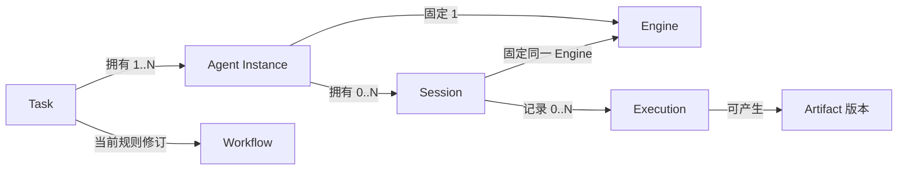

# 领域模型：概念、身份与关系

- 目的与范围：定义产品概念及不变量；状态见[生命周期与归属](lifecycle-and-ownership.md)，不规定 SDK、IPC 或数据库结构。
- 设计状态：产品原则来自 [VISION](../../VISION.md)；工具分属与协作边界分别遵循 [ADR 0002](../decisions/0002-engine-native-and-product-shared-tools-are-distinct.md)、[ADR 0003](../decisions/0003-cross-engine-collaboration-is-task-scoped.md)。下文具体身份、基数及生命周期是 Proposed，尚未获架构批准。
- 实现与验证状态：2026-09-22 检查当前仓库，尚无业务代码或领域行为测试；下文不是现有 API，也不是已验证能力。
- 关联文档：[文档入口](../README.md)、[Engine 契约](../specs/engine-adapter.md)、[协作契约](../specs/cross-engine-collaboration.md)、[共享能力](../specs/shared-capabilities.md)、[架构](../architecture/README.md)。

## DOM-01 概念及权威边界

产品身份由产品分配且不因 UI 重建而改变；外部身份只作为带来源的关联。名称、展示标题和进程号均不能替代稳定身份。

| 概念 | 含义、身份与归属 | 主要关联及不变量 | 不代表什么 |
| --- | --- | --- | --- |
| Engine | 完整 Agent 执行语义的提供者；产品登记 `engineId`，其实现及原生状态由该 Engine 负责 | 管理自己的 Agent Loop、上下文、原生工具；具体运行条件还包含版本、配置、执行环境和授权 | 不是 Model，也不是必须统领其他 Engine 的主 Harness |
| Model | Engine 使用的模型选择，按供应商及模型标识定位；由 Engine 支持的配置管理 | 一个 Engine 可支持多个 Model，实际可用性依运行条件声明 | 能输出文本的模型 API 不自动成为完整 Engine |
| Adapter | 产品契约与特定 Engine 原生接口的映射实现，按实现标识和版本识别 | 映射事件、身份、能力和行为；不拥有 Engine 的私有上下文 | 普通模型 API Adapter 不等同完整 Harness Adapter；映射不能创造原生能力 |
| Agent Instance | Task 内有职责的产品级参与者，持有 `agentInstanceId`，由产品管理 | 固定 Task、Engine，关联职责、权限范围和 Session；基数见 DOM-02 | 不是 Engine 进程、模型人格或全部原生子 Agent 的总称 |
| Session | 持续对话与运行状态的产品入口，持有 `sessionId`；产品管理关联，Engine 管理原生状态 | 终身绑定一个 Engine；恢复保留原绑定；关联原生标识与参与者 | 产品历史不是原生会话快照；复制历史不保证恢复私有上下文 |
| Execution | 一次已接纳的新执行输入对应的执行跟踪，持有 `executionId`，产品记录 Engine 可核实进展 | 属于一个 Session；待投递输入尚不是 Execution；运行中介入关联当前 Execution，不另建执行；重试在重新接纳后产生新 Execution 并关联前次 | 不是 Session、Task 或 Engine 内部每一步推理；不增设同义 Run、Attempt、Turn 实体 |
| Task | 用户目标、参与者、依赖、授权、产物与验收的协作边界，持有 `taskId`，由产品管理 | 明确目标及验收责任；可含一个或多个参与者；产品验收独立于执行结束 | 不是一轮模型回复或一定需要一个 LLM 主 Agent 的组织 |
| Workflow | Task 内显式的依赖和协作规则，按 Task 内标识及修订区分，由产品管理 | 本版建议每个 Task 使用一份当前规则修订，历史修订保留；可表达交接、串行、并行、交互 | 不是固定三阶段成熟度，也不要求消息总线或独立调度进程 |
| Workspace | 被授权访问的项目资源及所在环境，持有 `workspaceId`，产品保存定位和授权范围 | Task 可使用多个 Workspace；Engine 与 Workspace 组合需要能力核实 | 不是天然沙箱；工作目录和 Git worktree 不构成完整隔离 |
| Artifact | 可追溯的结果资产，持有 `artifactId` 及版本标识，产品记录生产者、来源和访问范围 | 关联 Task、参与者、Execution（有执行来源时）和资源版本；发布不等于验收 | 不是可任意共享的文件路径；可变外部引用不等于已固定内容 |
| Context Material | 经授权可传递的目标、摘要、文件引用等材料，按来源、版本和披露范围标识 | 可成为消息或 Handoff 材料；来源、接收者和必要裁剪可追踪 | 不是各 Engine 的共享内存，也不保证包含私有上下文 |

README 中的 Jobs 与 VISION 中的 Automation 表达长期自动化能力；本轮不引入独立 Job 生命周期，未来定时触发可创建 Task 或输入，另行定义调度契约。文中的“轮”只是原生交互的描述，不新增实体。

## DOM-02 关联基数与身份连续性（Proposed）

首选 Task 作用域的参与者身份，避免一个参与者在多个任务中混用职责和授权；跨任务复用配置可创建新的参与者。一个参与者固定一个 Engine，拥有零到多个同 Engine Session；每个 Session 仅归属一个参与者，从而间接属于一个 Task。参与者尚未启动时允许零 Session，创建失败不会抹掉其分工记录。

多个 Session 用于有序替换或明确命名的独立分支，不自动复制原生上下文。每次输入必须选定目标 Session，禁止默认广播；独立分支可并行，但须分别获得共享资源访问范围。更换 Engine 创建新参与者及新 Session，以交接关联保留责任链；相同 Engine 新建 Session 则可保留参与者身份。

图示描述进入协作后的 Task；草稿 Task 可尚无参与者。首版建议一个 Session 同时最多一个进行中的 Execution，只有前次终结后才接纳下一次执行；产品队列中的输入不是已接纳执行。支持运行中介入的 Engine 可把消息加入当前 Execution，接纳该介入只更新独立输入／消息记录并关联当前执行，不创建第二个 Execution；若选择下一轮投递，则待当前执行终结并接纳新执行输入后才创建新 Execution。介入能力与可观察证据按[接入规格](../specs/engine-adapter.md)声明，不能据此隐式开启并发执行。该限制简化顺序及恢复，不限制不同 Session 并行；未来放宽需先定义关联和冲突语义。

这组基数是首选提案，不是 ADR 0003 的既定结论。替代方案是参与者与 Session 一对一，结构较小但会把恢复失败后重建会话误写成换人；或跨 Task 复用参与者，便于常驻角色但增加授权和职责混用。当前选择优先责任清晰，代价是需要明确 Session 选择和跨任务配置复用。

## DOM-03 产品参与者与原生子 Agent

只有经产品登记并具有 Task 职责、权限范围及可追踪 Session 的对象才是产品参与者。Engine 内部创建的原生子 Agent 仍归 Engine 管理。Adapter 可以呈现实际公开的父子关联及状态，但不能因显示了“子 Agent”就承诺可独立发消息、取消、恢复或分配权限。需要将其提升为产品参与者时，必须先证明可独立满足接入契约，否则仅作为诊断或原生扩展展示。

## DOM-04 共享资产与扩展归属

Browser 是产品共享资源，以浏览器上下文、标签等可授权资源身份关联 Task 和参与者；Computer Use 是面向桌面操作的另一类能力，二者不互相暗示授权。共享资源的访问者可以有多个，但修改责任和结果整合责任必须明确，具体约束唯一放在[共享能力规格](../specs/shared-capabilities.md)。

工具的配置、执行和状态归属遵循 ADR 0002；产品不以统一展示接管原生工具。Repo Wiki 等领域扩展可产生知识 Artifact，按 [ADR 0001](../decisions/0001-domain-tools-are-optional-plugins.md)使用公共能力，不成为 Core 的必需模块。

## 未决问题与验证入口

维护者需评审 DOM-02 的 Task 作用域、一对多 Session 和单 Session 串行执行提案，以及 Workflow 当前修订模型。验收时构造同 Engine 重建 Session、跨 Engine Handoff、两 Session 并行三个案例，检查身份、授权、上下文和责任链是否仍唯一可解释；另向一个运行中的 Session 投递获接纳的介入消息，断言仍只有一个 Execution、消息独立可追踪，随后下一轮输入获接纳时才新增执行；对缺失原生子 Agent 控制能力的 Engine 验证 DOM-03 的降级。状态判定按[生命周期规则](lifecycle-and-ownership.md)验证，不在此另设状态表。
