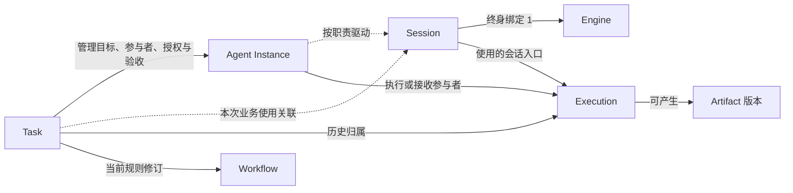

# 领域模型：概念、身份与关系

- 目的与范围：定义产品概念及不变量；状态见[生命周期与归属](lifecycle-and-ownership.md)，不规定 SDK、IPC 或数据库结构。
- 设计状态：产品原则来自 [VISION](../../VISION.md)；工具分属与协作边界分别遵循 [ADR 0002](../decisions/0002-engine-native-and-product-shared-tools-are-distinct.md)、[ADR 0003](../decisions/0003-cross-engine-collaboration-is-task-scoped.md)。ADR 0003 与 ADR 0004 的已接受语义不因本轮改变。D-101 已批准 DOM-02 中明确标出的 M1 单参与者语义；长期关系模型、超出 M1 的协作策略及未来复用条件仍为 Proposed。
- 实现与验证范围以当前代码、测试和运行记录为准；下文定义领域语义，不单独证明能力已实现。
- 关联文档：[文档入口](../README.md)、[Engine 契约](../specs/engine-adapter.md)、[协作契约](../specs/cross-engine-collaboration.md)、[共享能力](../specs/shared-capabilities.md)、[架构](../architecture/README.md)。

## DOM-01 概念及权威边界

产品身份由产品分配且不因 UI 重建而改变；外部身份只作为带来源的关联。名称、展示标题和进程号均不能替代稳定身份。

| 概念 | 含义、身份与归属 | 主要关联及不变量 | 不代表什么 |
| --- | --- | --- | --- |
| Engine | 完整 Agent 执行语义的提供者；产品登记 `engineId`，其实现及原生状态由该 Engine 负责 | 管理自己的 Agent Loop、上下文、原生工具；具体运行条件还包含版本、配置、执行环境和授权 | 不是 Model，也不是必须统领其他 Engine 的主 Harness |
| Model | Engine 使用的模型选择，按供应商及模型标识定位；由 Engine 支持的配置管理 | 一个 Engine 可支持多个 Model，实际可用性依运行条件声明 | 能输出文本的模型 API 不自动成为完整 Engine |
| Adapter | 产品契约与特定 Engine 原生接口的映射实现，按实现标识和版本识别 | 映射事件、身份、能力和行为；不拥有 Engine 的私有上下文 | 普通模型 API Adapter 不等同完整 Harness Adapter；映射不能创造原生能力 |
| Agent Instance | Task 内有职责的产品级参与者，持有 `agentInstanceId`，由产品管理 | 固定 Task、Engine，关联职责、权限范围和本次业务使用的 Session；基数见 DOM-02 | 不是 Engine 进程、模型人格或全部原生子 Agent 的总称 |
| Session | 持续对话与运行状态的产品入口，持有 `sessionId`；产品保存身份与业务使用关联，Engine 管理原生状态 | 终身绑定一个 Engine，恢复保留原绑定；长期方向上可记录不同 Task／参与者的业务使用关联，但不以某个 Task 或参与者作为永久生命周期所有者；首版按 DOM-02 默认新 Task 新 Session，暂不支持跨 Task 复用 | 产品历史不是原生会话快照；复制历史不保证恢复私有上下文；当前使用者不能决定历史归属 |
| Execution | 一次已接纳的新执行输入对应的执行跟踪，持有 `executionId`，产品记录 Engine 可核实进展 | 同时明确关联一个 Task、Task 范围内的参与者和一个 Session，并保存产品请求、原生执行及来源证据；待投递输入尚不是 Execution；运行中介入关联当前 Execution，不另建执行；重试在重新接纳后产生新 Execution 并关联前次 | 不是 Session、Task 或 Engine 内部每一步推理；不增设同义 Run、Attempt、Turn 实体；历史关联不会被后续 Session 使用覆盖 |
| Task | 用户目标、参与者、依赖、授权、产物与验收的协作边界，持有 `taskId`，由产品管理 | 明确目标及验收责任；可含一个或多个参与者；产品验收独立于执行结束 | 不是一轮模型回复或一定需要一个 LLM 主 Agent 的组织 |
| Workflow | Task 内显式的依赖和协作规则，按 Task 内标识及修订区分，由产品管理 | 本版建议每个 Task 使用一份当前规则修订，历史修订保留；可表达交接、串行、并行、交互 | 不是固定三阶段成熟度，也不要求消息总线或独立调度进程 |
| Workspace | 被授权访问的项目资源及所在环境，持有 `workspaceId`，产品保存定位和授权范围 | Task 可使用多个 Workspace；Engine 与 Workspace 组合需要能力核实 | 不是天然沙箱；工作目录和 Git worktree 不构成完整隔离 |
| Artifact | 可追溯的结果资产，持有 `artifactId` 及版本标识，产品记录生产者、来源和访问范围 | 关联 Task、参与者、Execution（有执行来源时）和资源版本；发布不等于验收 | 不是可任意共享的文件路径；可变外部引用不等于已固定内容 |
| Context Material | 经授权可传递的目标、摘要、文件引用等材料，按来源、版本和披露范围标识 | 可成为消息或 Handoff 材料；来源、接收者和必要裁剪可追踪 | 不是各 Engine 的共享内存，也不保证包含私有上下文 |

README 中的 Jobs 与 VISION 中的 Automation 表达长期自动化能力；本轮不引入独立 Job 生命周期，未来定时触发可创建 Task 或输入，另行定义调度契约。文中的“轮”只是原生交互的描述，不新增实体。

## DOM-02 关联基数与身份连续性（Proposed）

长期模型方向（Proposed）是把 Session 表达为某个 Engine 的持续会话入口及其原生状态关联，不把某个 Task 定义为 Session 的永久生命周期所有者。Task 管理目标、参与者职责、授权、协作和验收；Agent Instance 暂时继续使用 Task 范围内的参与者身份。Task／参与者与 Session 之间记录按次的业务使用关联，而不是用永久所有权推导业务归属。输入和 Execution 必须明确记录所属 Task、参与者、使用的 Session，以及产品请求、原生执行和来源证据；历史归属不能通过 Session 当前正在为哪个 Task 工作动态推导，也不能被后续使用关系覆盖。

这是产品侧契约：Host 和 Adapter 负责可靠建立、校验和保存这些业务关联及来源证据，不要求原生 Engine 直接识别全部产品 Task、参与者或请求标识；产品仍须如实表达 Engine 的能力边界。

### M1 单参与者语义（D-101 已批准）

M1 只交付单参与者路径。同一 Task 的多轮工作继续使用同一产品 Session；新独立 Task 使用新参与者和新 Session，必须拒绝将旧 Task 的 Session 直接用于新 Task。一个 Session 同时只允许一个明确参与者驱动，且最多有一个进行中的 Execution；运行中介入关联现有 Execution，不能另建并发 Execution。每次业务请求均按 [LIFE-ADMISSION](lifecycle-and-ownership.md#life-admission-业务接纳资格proposed) 重新核验；输入、Execution 及迟到事件保留原 Task／参与者／Session 归属，不能从当前 UI 任务或 Session 最近使用者推导。

用户可见的对话入口对应产品 Session；Engine 原生会话 ID 是产品 Session 的外部映射信息，不能替代产品身份。该语义不要求新增 Conversation 实体，也不要求实现同一对话中的 Engine 热切换。

超出 M1 的协作策略仍为 Proposed：同一 Task 可有多个参与者和多个 Session，一个参与者可按需要使用多个同 Engine Session；不同 Session 可独立协作或并行。跨 Engine Handoff 使用新 Session，并按显式规则传递获准材料。未来关系和协作的交付范围以对应 Milestone／Issue 为准。

“首版”中超出上述 M1 单参与者语义的关系及协作能力仍是提案；不表示近期 Milestone 必须交付全部协作功能，交付范围以 GitHub Milestone／Issue 为准。

多个 Session 不自动复制原生上下文。每次输入必须选定目标 Session 和本次业务使用关联，禁止默认广播；独立 Session 可并行，但须分别获得共享资源访问范围。更换 Engine 创建新参与者及新 Session，以交接关联保留责任链；相同 Engine 新建 Session 则可保留当前 Task 内参与者身份。参与者尚未启动时允许零 Session，创建失败不会抹掉其分工记录。

图示描述完整协作模型中的 Task；草稿 Task 可尚无参与者。Task 管理参与者，Session 固定 Engine，业务使用关联和 Execution 分别记录本次使用及不可变历史归属，不能用一个 `owns` 关系混合这些职责。M1 已批准的单 Session 规则是：一个 Session 同时最多一个进行中的 Execution，由一个明确参与者驱动，只有前次终结后才接纳下一次执行；产品队列中的输入不是已接纳执行。支持运行中介入的 Engine 可把消息加入当前 Execution，接纳该介入只更新独立输入／消息记录并关联当前执行，不创建第二个 Execution；若选择下一轮投递，则待当前执行终结并接纳新执行输入后才创建新 Execution。介入能力与可观察证据按[接入规格](../specs/engine-adapter.md)声明，不能据此隐式开启并发执行。不同 Session 并行及冲突处理不属于 M1，仍属 Proposed。

Session 是否可以接纳业务由 [LIFE-ADMISSION](lifecycle-and-ownership.md#life-admission-业务接纳资格proposed) 决定，必须同时校验本次请求的 Task、参与者、Session 使用关联、Engine／Adapter 能力、授权及执行环境。按已批准的 M1 策略，终态后的新目标创建关联的新 Task、新参与者和新 Session；Task B 请求使用 Task A 的既有 Session 时明确拒绝，不重绑旧记录或伪造恢复，可改走新 Session 与获准材料交接。原生 Session 恢复成功也不改变历史归属或自动授予业务执行权。

长期关系模型与超出 M1 的运行策略仍为 Proposed，不是 ADR 0003 的既定结论。M1 已批准规则仅约束单参与者交付路径，不固定 Agent Instance 与 Session 的长期基数，也不决定参与者跨 Task 常驻。其他关系方案及其授权、历史和上下文披露取舍仍待评审。未来是否允许同一 Engine Session 在多个 Task 之间显式串行使用，仅按 [DOM-05](#dom-05-未来跨-task-串行复用条件proposed) 的准入方向继续评估，不在 M1 承诺。

## DOM-03 产品参与者与原生子 Agent

只有经产品登记并具有 Task 职责、权限范围及可追踪 Session 的对象才是产品参与者。Engine 内部创建的原生子 Agent 仍归 Engine 管理。Adapter 可以呈现实际公开的父子关联及状态，但不能因显示了“子 Agent”就承诺可独立发消息、取消、恢复或分配权限。需要将其提升为产品参与者时，必须先证明可独立满足接入契约，否则仅作为诊断或原生扩展展示。

## DOM-04 共享资产与扩展归属

Browser 是产品共享资源，以浏览器上下文、标签等可授权资源身份关联 Task 和参与者；Computer Use 是面向桌面操作的另一类能力，二者不互相暗示授权。共享资源的访问者可以有多个，但修改责任和结果整合责任必须明确，具体约束唯一放在[共享能力规格](../specs/shared-capabilities.md)。

属于 Task 的共享业务调用，其授权必须绑定本次 Task、参与者、Session 使用关联和必要的 Execution；其他资源调用继续遵循 CAP-02 的直接用户来源或调用者自身授权规则。Session 曾经获准使用某项资源，不会把该授权继承给新 Task。未知执行造成的资源占用或冲突限制在任务收尾后仍然有效。

工具的配置、执行和状态归属遵循 ADR 0002；产品不以统一展示接管原生工具。Repo Wiki 等领域扩展可产生知识 Artifact，按 [ADR 0001](../decisions/0001-domain-tools-are-optional-plugins.md)使用公共能力，不成为 Core 的必需模块。

## 未决问题与验证入口

维护者仍需评审 DOM-02 的长期关系方向、超出 M1 的多参与者和多 Session 协作，以及 Workflow 当前修订模型；M1 新 Task 新 Session 和单 Session 串行规则已获批准。后续协作验收可构造同 Engine 重建 Session、跨 Engine Handoff、两 Session 并行等案例，检查身份、授权、上下文和责任链是否仍唯一可解释。若未来接入声明支持运行中介入的 Engine，应验证介入消息独立可追踪且不创建第二个并发 Execution，下一轮输入获接纳时才新增执行；缺失原生子 Agent 控制能力的 Engine 按 DOM-03 验证降级。状态判定按[生命周期规则](lifecycle-and-ownership.md)验证，不在此另设状态表。

Session 跨 Task 连续性仍是长期 Proposed 方向。M1 的新 Task 新参与者／新 Session 是已批准的当前策略，不是永久不变量；跨 Task 复用若未来被选择，必须按 [DOM-05](#dom-05-未来跨-task-串行复用条件proposed) 验证任务授权隔离、旧上下文披露、并发归属及历史验收边界，不能只改一个关联字段。以下场景用于比较当前策略与未来串行复用：

| 连续性场景 | 当前策略的结果 | 跨 Task 复用方案需要回答的问题 |
| --- | --- | --- |
| 同 Task 内多轮实现、评审与修复 | 继续原 Task 与原 Session；每次输入重新核对业务资格，不因一次 Execution 完成就新建 Task | 未来仍需确认同一 Session 的串行控制、迟到证据和参与者责任是否可持续 |
| Task 已验收，用户沿用同一 Engine 做后续目标 | 创建新 Task、新参与者和新 Session；旧 Session 与原 Task 历史保留，后续只能经授权引用旧目标、摘要和产物 | 是否满足 DOM-05 的全部条件，以及旧原生上下文能否向新 Task 及其模型接收方披露 |
| 常驻 Agent 连续处理多个独立 Task | 复用 Engine 与角色配置，但参与者仍按 Task 新建，每个 Task 首次业务使用默认新建 Session | 如何在未来建立显式串行复用选择、清理在途动作、独立授权和按 Task 固定历史归属 |

## DOM-05 未来跨 Task 串行复用条件（Proposed）

本节只记录未来功能的准入方向，不表示首版支持、API 已存在或实现已批准。未来若评估让同一 Engine Session 在多个 Task 之间串行使用，至少需要同时满足以下条件：

1. 始终使用同一个 Engine，并核实对应原生身份、版本、存储和运行环境。
2. 原 Task 不再驱动该 Session；不存在未清理的在途 Execution、未决投递、审批或可能继续产生动作的控制状态。
3. 新 Task、参与者和授权已独立建立并完成校验。
4. 旧上下文允许向新 Task 及其模型接收方披露。
5. 同一时刻只有一个明确参与者驱动该 Session。
6. 输入、结果和迟到事件可以可靠关联到各自的 Task／Execution。
7. 用户显式选择复用；Engine 或 Adapter 不支持时如实拒绝，并提供新 Session 与获准材料交接路径。
8. Task 放弃协调或归档不能作为满足上述条件的证据。

这些条件不构成首版关联表、数据库结构或跨 Task Session API，也不承诺所有 Harness 都能安全复用原生上下文。默认新建 Session 也不代表完整安全隔离；即使未来满足准入条件，仍需核实 Engine 的原生配置、记忆、工具和执行环境。
